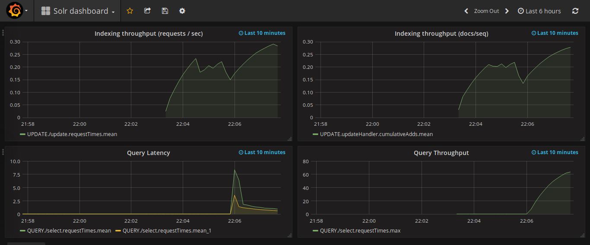

# solr-grafana-docker
Solr with pre-imported Grafana dashboard

Steps to run
------------

```bash
docker-compose down
docker-compose up

# Navigate to http://localhost:3000 (username=admin, password=admin)
# Click on "Solr dashboard"

# In a new terminal
./indexing.sh

# Refresh the dashboard
```

Screenshot
----------


