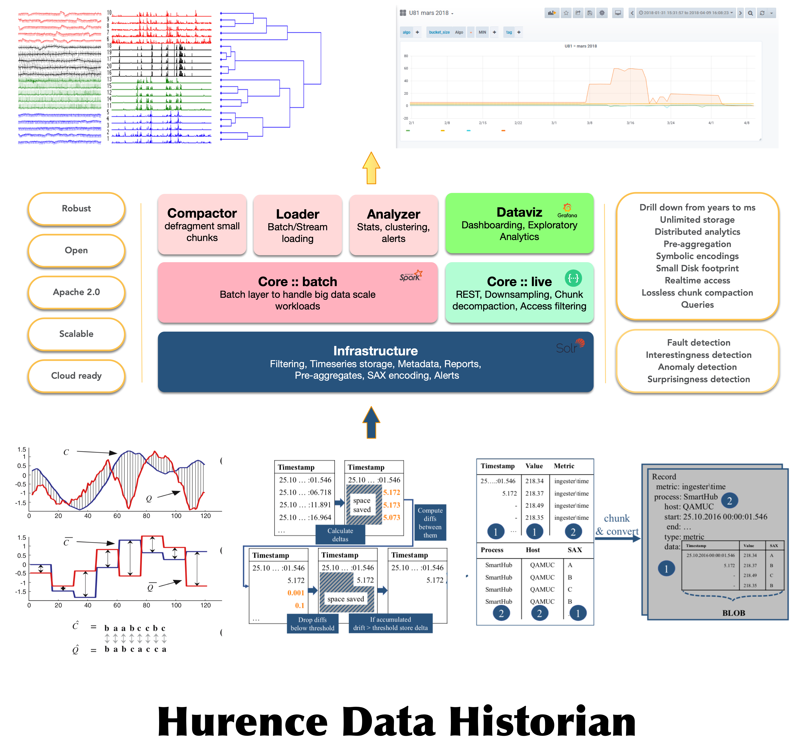

Smart historian is based on some layers

1. A distributed search engine backend as foundation stone. This will hold the chunks of data and ensure availability and scalability. 
2. A chunk conversion library. Written in Java and [Protocol Buffers](https://developers.google.com/protocol-buffers)
3. 

### Overall view

