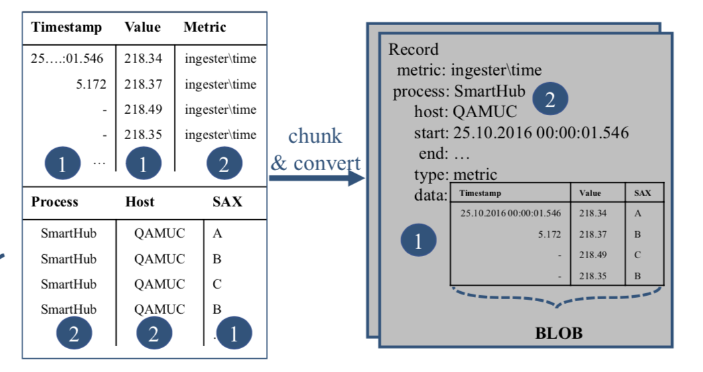

This is a free solution to handle massive loads of timeseries data into a search engine (such as Apache SolR). It is built to store time series highly compressed and for fast access times. In comparison to related time series databases, Smart Historian does not only take 5 to 171 times less space, but it also shaves off 83% of the access time, and up to 78% off the runtime on a mix of real world queries (single node benchmark)

### Time compaction
The first gain come from storing only offsets in timestamps and (optionnaly) removing values below a timestamp delta threshold.

### Blob encoding
This is the process of converting a set of related `Measures`  (uniquely identified by a name and a set of key/value tags) into a `Chunk`. A `Measure` for example could be `cpu_time{ host="computer1", dc="datacenter1"}` and another one `cpu_time{ host="computer2", dc="datacenter2"}` both sharing the same name but with different tag values. The `start` timestamp is the earliest timestamp of the `Measure`'s set and the `end` timestamp is the latest timestamp of the `Measure`'s set.

### The key entities

- **Measure** is a point in time with a floating point value identified by a name and some tags (categorical features)
- **Chunk** is a set of contiguous Measures with a time interval grouped by a date bucket, the measure name and some tags

The main purpose of this tool is to help creating, storing and retrieving these chunks of timeseries.
We use chunking instead of raw storage in order to save some disk space and reduce costs at scale. Also chunking is very usefull to pre-compute some aggregation and to facilitate down-sampling
    

  
Chunk encode value

  

    
The chunk value is a protocol buffer encoded value according to the protobuf  specification], please refer to <a href="data-model">data model section</a> to learn more about that.

  

---

### SAX symbolic encoding

Note that the Chunk has aggregated fields. In addition to the classic statistics on the value and the quality of the point, we also integrate symbolic encoding with SAX.

The advantage of using SAX is that it is able to act as a dimensionality reduction tool, it tolerates time series of different lengths and makes it easier to find trends.

[SAX encoding](sax-encoding) is a method used to simplify time series through a kind of summary of time intervals. By averaging, grouping and symbolically representing periods, the data becomes much smaller and easier to process, while still capturing its important aspects. For example, it can be used to detect statistical changes in trends and therefore abnormal behavior.

### SensorML (future work)

SensorML provides standard models and an XML encoding for describing any process, including the process of measurement by sensors and instructions for deriving higher-level information from observations. It provides a provider-centric view of information in a sensor web, which is complemented by Observations and Measurements which provides a user-centric view.

Processes described in SensorML are discoverable and executable. All processes define their inputs, outputs, parameters, and method, as well as provide relevant metadata. SensorML models detectors and sensors as processes that convert real phenomena to data.

SensorML does not encode measurements taken by sensors; measurements can be represented in TransducerML, as observations in Observations and Measurements, or in other forms, such as IEEE 1451.