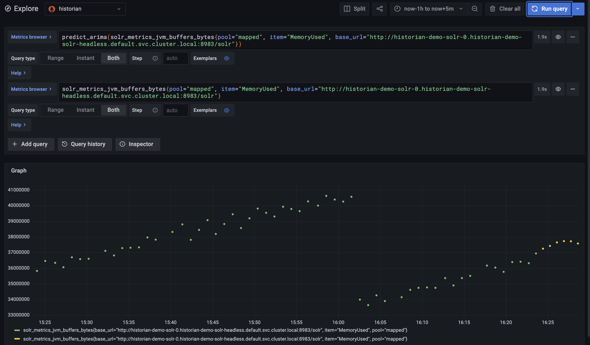

you can browse your dashboard

based on https://www.robustperception.io/reduce-noise-from-disk-space-alerts#more-614

How often have you gotten alerted about disk space going over some threshold, only to discover it'll be weeks or even months until the disk actually fills? Noisy alerts are bad alerts. The new predict_linear() function in Prometheus gives you a way to have a smarter, more useful alert.

Disk filling up is undesirable as many applications and utilities don't deal well with being unable to make changes to files. A standard way to protect against this is to have alerts when a disk is filling up, and a human will fix the problem before it's too late. Typically this is done based on simple thresholds such as 80%, 90% or 10GB left. This works when there are moderate spikes in disk usage and uniform usage across all your servers, but not so well when there's very gradual growth or the growth is so fast that by the time you get the alert it's too late to do something about it.

What if instead of a fixed threshold, you could alert if the disk was going to fill up in 4 hours time? The predict_linear() function in Prometheus allows you to do just that. It uses a linear regression over a period of time to predict what the value of a timeseries will be in the future. Here's what it looks like:

- name: node.rules
  rules:
    - alert: DiskWillFillIn4Hours
      expr: predict_linear(node_filesystem_free{job="node"}[1h], 4 * 3600) < 0
      for: 5m
      labels:
      severity: page

A deeper look
Let's look at this alert definition piece by piece.

- name: node.rules
  rules:
  The start of the rules file states the name of the rules file and the beginning of the list of the rules contained within.

- alert: DiskWillFillIn4Hours
  This is the start of the first alert definition and where the name of the alert is set.

expr: predict_linear(node_filesystem_free{job="node"}[1h], 4 * 3600) < 0
This is the meat of the alert, the expression that'll trigger a notification to the alertmanager. node_filesystem_free{job='node'}[1h] retrieves an hour worth of history. This is passed to predict_linear which uses it to predict 4 hours forwards, as there are 3600 seconds in an hour. < 0 is a filter that only returns values less than 0.

for: 5m
This makes Prometheus wait for the alert to be true for 5 minutes before sending a notification. This helps avoid false positives from brief spikes and race conditions.

labels:
severity: page
This sets an additional label on the alert called severity with the value page. This can be used to route the alert in the alertmanager to your paging system, rather than having to individually list what alert goes where.

Putting it all together
The above alert should be put in a file called node.rules.

Add the rules file to your Prometheus configuration in prometheus.yml:

global:

# Paths are relative to the configuration file.
rule_files:
- path/to/node.rules

scrape_configs:
.
.
.

If you haven't already done so, configure the alertmanager. Finally either restart or send a SIGHUP to Prometheus to reload it's configuration.

If you visit the /alerts endpoint on Prometheus, you will see your new alert. You can click on it for additional detail.