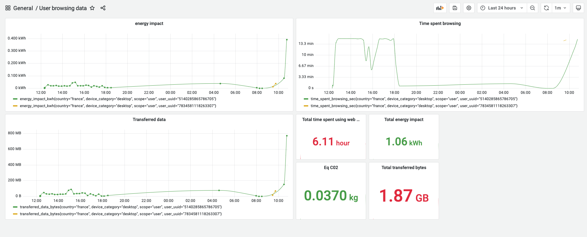
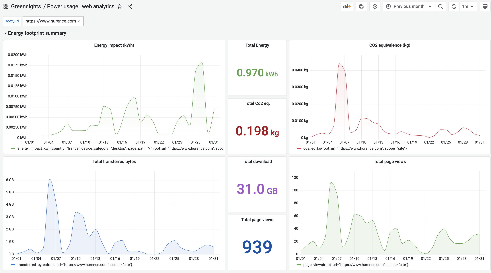
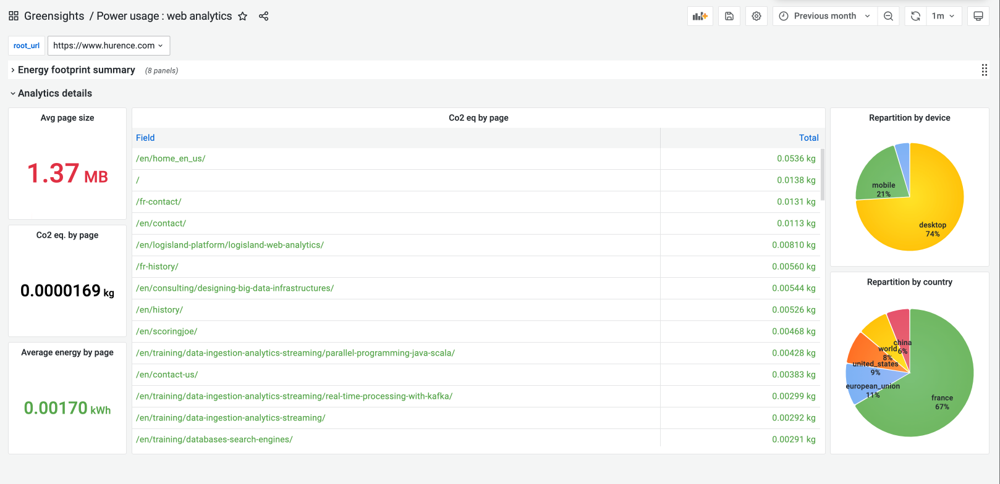

the platform is currently freely available for early adopters. please [Contact Us](mailto:thomas.bailet@hurence.com) if you're interested in contributing or being a beta tester.

If you (still) wonder why we need such a platform, just take the time to read [the lean ICT manifest for digital sobriety](lean-ict) or even [The worrying trajectory of energy consumption by digital technology](https://imtech.wp.imt.fr/en/2020/05/28/the-worrying-trajectory-of-energy-consumption-by-digital-technology/)

This was the warmup, now you're ready to take the first step to the digital sobriety : know where you are before even thinking to fix yourself some quantifiable goals to be more sustainable. You won't be able to reduce your organization's digital footprint if you are not actually capable of measuring it. Before going any further we need to see and understand what are the sources of impact in our organization.

    This is the first feature of Greensights : measure your digital footprint across time.

## measure digital environmental footprint

There are 2 main aspects of environmental impacts : production and use of devices. To reduce the first one, our organization needs to make better (and longer) use of hardware it already has, as well as trying to reduce it. To reduce the second one, we need to avoid resource waste at all costs and to optimize software execution over those hardware resources.

Greensights will help your organization to track the hardware footprint and also to estimate the software consumption too.

### Measure personal web energy consumption

The first way to measure things, may be a little anecdotal (surely not accurate but really informative) is to monitor personal web browsing impact through a small browser extension that shows you (and only you) what is your top ten consumming web source. You can then see for example, that your favorite music stream is really eager in bytes and that you'd better listen to your mp3 playlist (even if it's going to be challenging to listen to music whithout any request to a streaming platform)

if you fill your personal account name and key (which are not stored, only a generated uuid to preserve privacy), 3 aggregated metrics are sent every 15' to greensights server :

- total downloaded bytes
- total time spent browsing
- total energy impact in KWh (inferred from the [oneByteModel](https://theshiftproject.org/wp-content/uploads/2018/10/Lean-ICT-Materials-1byte-Model-2018.xlsx))

this will be used to compute user browsing patterns and to generate monthly reports that can be requested by users to see their impact tendencies. We think that this link with general users is useful to create a community of people concerned with IT environmental impact for sharing good practice and data.

### measure web app energy consumption through Google Analytics

Now we'll have a look to which insights we could gain from web trafic analytics gathered through Google Analytics API. By the simple fact of authorizing a service email (personal to each organization), greensights server instance will be able to query Google Analytics in your name and to get all trafic data for the requested period (can be scheduled as a cron task). Greensights server will then compute the corresponding energy impact in KWh (inferred from the [oneByteModel](https://theshiftproject.org/wp-content/uploads/2018/10/Lean-ICT-Materials-1byte-Model-2018.xlsx)).

The energy impact of one action will be computed with the following formula :

    EnergyImpactInKwh = timeSpentOnActionInMin * deviceImpact + dataSizeInByte * (dataCenterImpact + networkImpact)

So we need to query Google Analytics to get :

- time spent on the action (web page view)
- the type of device
- the data size involved in the action

the data is then stored into data historian for long term storage and further analytics. It can be easily queried through grafana to build custom dashboards. You can then gain time-based insights of your web app energy impact. Again the OneByteModel can be questioned as it certainly over-estimates energy impact. But the interesting things with this approach are the fact that :

- you can track global energy impact evolution in time
- you can see what a new release or code change does to energy consumption
- you can set alarms on consumption thresholds and give your dev teams objectives to remain under those thresholds.

### Measure infrastructure (Kubernetes) energy footprint 

Now it's time to dive into the infrastructure level. There we use the [scaphandre](https://hubblo-org.github.io/scaphandre-documentation/explanations/how-scaph-computes-per-process-power-consumption.html) toolbox to compute per process power consumption for each server node of our datacenter. This works especially well for on-premise servers or kubernetes architectures.

You can then monitor what is going on at process level for the whole architecture and see for example that you have some `java` processes that are way too greedy comparing to other similar processes. 

This is where ou development team is focusing the most to add features

## make the link between hardware and software

For now, we've got a tool that enables us to monitor some levels of IT impacts (mostly energy and carbon equivalency).

...

## Set reduction goals

...