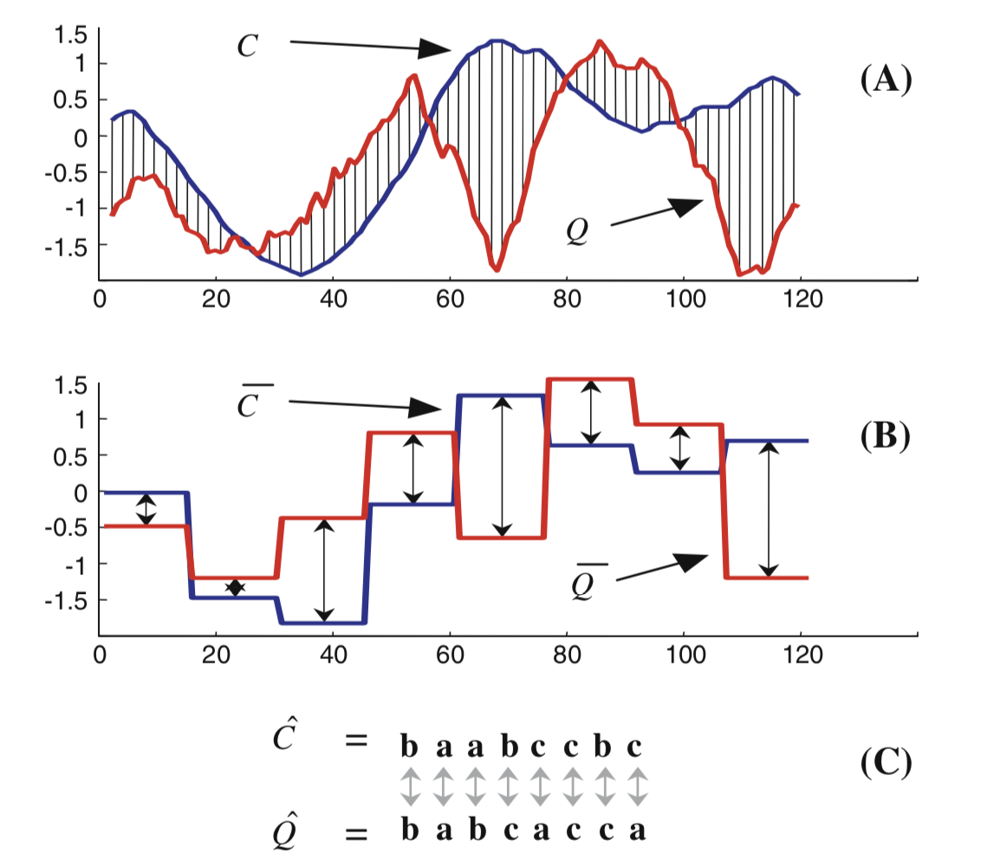

SAX transforms a numerical time series into a sequence of symbols taking their values in a finite alphabet. This method is very simple and does not require any a priori information about the input time series (apart from the distribution should be Gaussian with zero mean and unit variance). SAX representation is based on three steps:

1. Divide a time series into segments of length L
2. Compute the average of the time series on each segment
3. Quantize the average values into a symbol from an alphabet of size N SAX makes the assumption that time series values follow a Gaussian distribution. The quantization step makes use of (N − 1) breakpoints that divide the area under the Gaussian distribution into N equiprobable areas. These breakpoints can be found in lookup tables. Hence, the average values computed for each segment of the time series (step 2 above) are then quantized according to the breakpoints of the Gaussian distribution. Fig. 1 shows an example of the
   SAX representation of a time series with N = 4.

- [https://www.kdnuggets.com/2019/09/time-series-baseball.html](https://www.kdnuggets.com/2019/09/time-series-baseball.html)
- [http://www.marc-boulle.fr/publications/BonduEtAlIJCNN13.pdf](http://www.marc-boulle.fr/publications/BonduEtAlIJCNN13.pdf)

