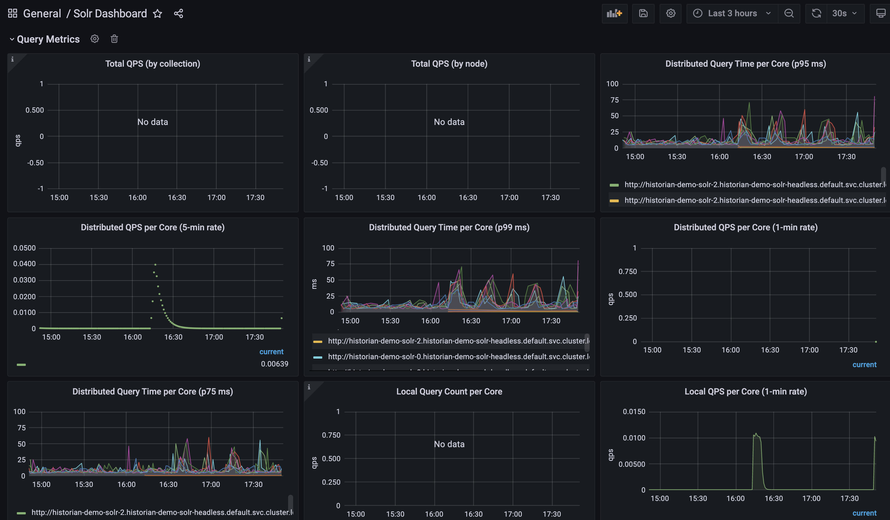
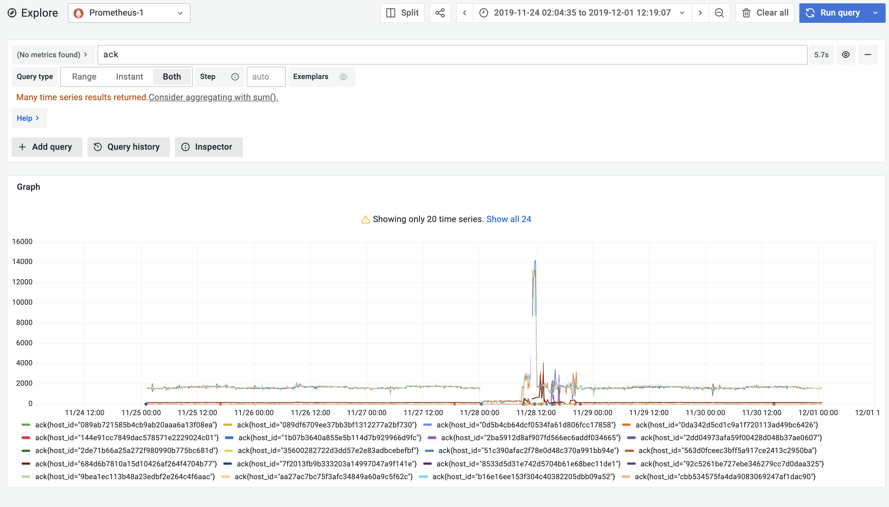
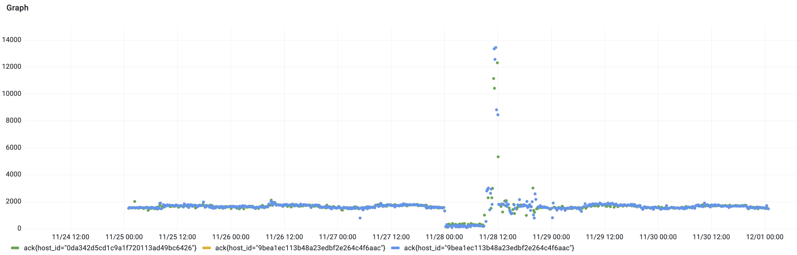

## Solr Monitoring
Here is an example dashboard of Historian monitoring its own solR backend

## Data mining

Back to the [clustering tutorial](clustering), remeber that we've found something strange happening on day `2019-11-28` on `ack` for host_id=`51c390afac2f78e0d48c370a991bb94e, 0da342d5cd1c9a1f720113ad49bc6426, 9bea1ec113b48a23edbf2e264c4f6aac` 

Let's first graph all `ack` measures in the correct date range (rember we're not in 2019 anymore)

and then drill down to those clustered host_id. something funny isn't it. This high peak of acknowledgement requests !!

